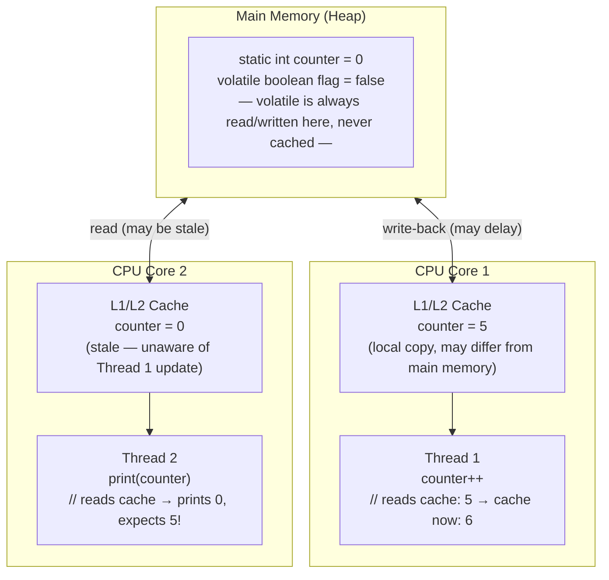
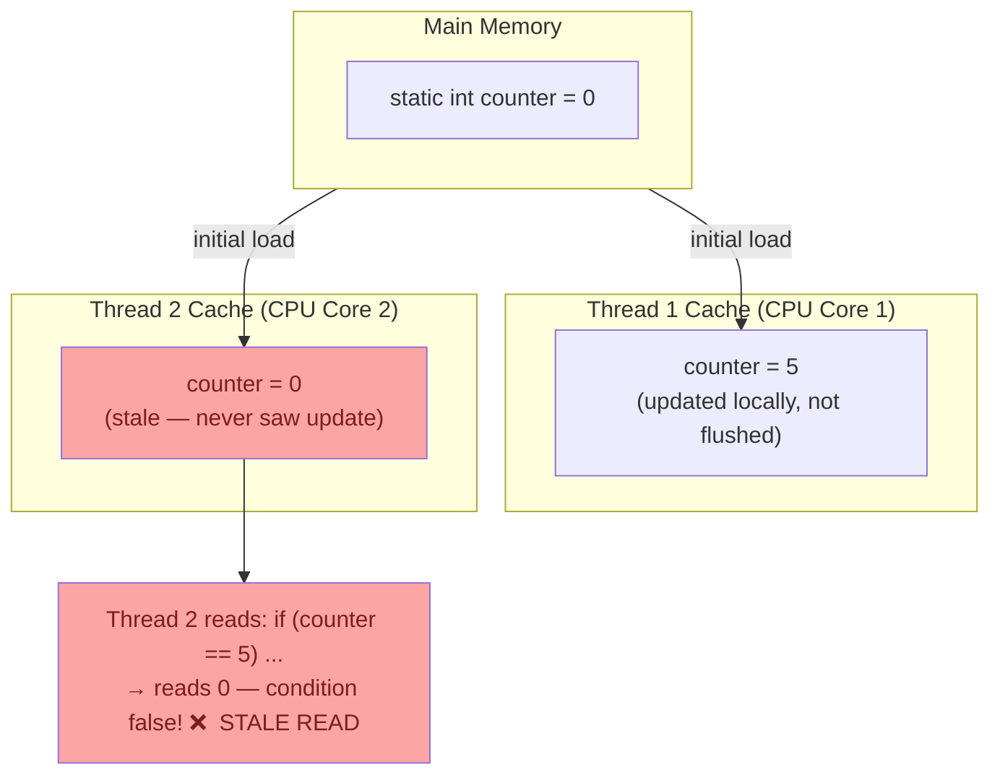
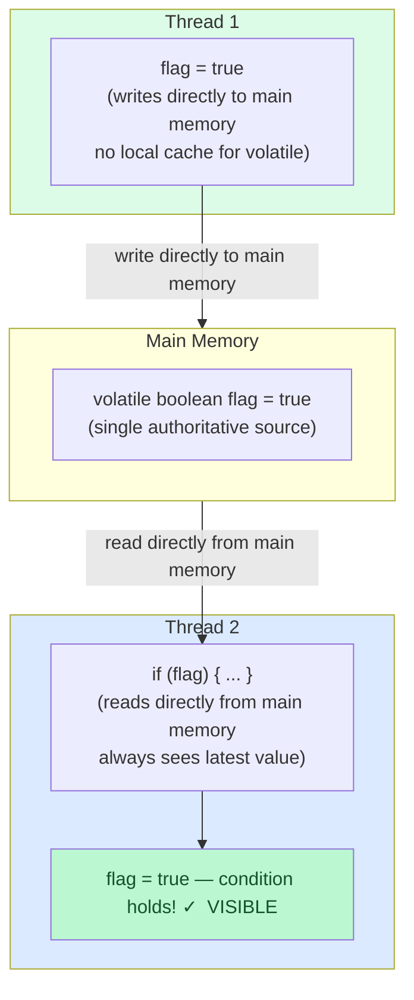
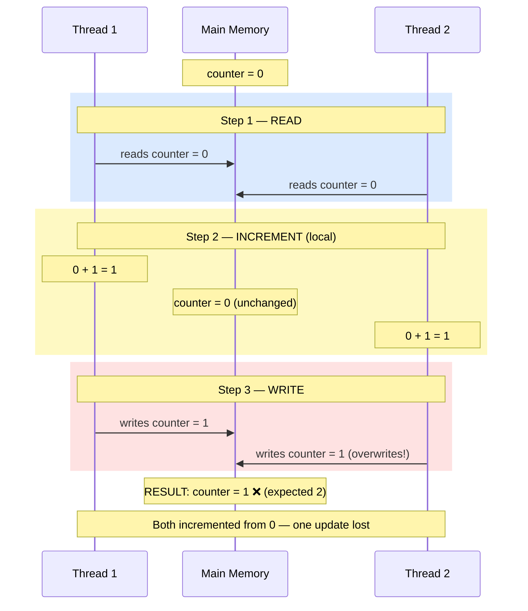

`static` and `volatile` both deal with shared data, but they solve completely different problems. Conflating them is one of the most common sources of subtle multithreading bugs in Java. This post explains exactly what each does, why the difference matters, and when to use each.

## The Java Memory Model

Modern CPUs do not read from RAM on every variable access — they maintain L1 and L2 caches per core to avoid the latency cost. The JVM is allowed to exploit this: it may keep a variable's value in a CPU register or cache instead of reading it from main memory on every access.

This is a deliberate performance optimisation. It also means that two threads running on different CPU cores can hold **different values for the same variable** at the same time.



This is the Java Memory Model (JMM) in one picture. Main memory holds the authoritative value. Each CPU core has its own cache. Threads read from and write to their core's cache, not necessarily to main memory.

## `static` — one instance, but threads can still cache it

`static` is a **scope modifier**. A `static` variable belongs to the class, not to any instance. There is exactly one copy in the JVM, shared across all instances of that class.

```java
class Counter {
    static int count = 0;  // one copy, shared by all instances
}
```

What `static` does **not** do: it gives no guarantee about memory visibility across threads. The JVM may cache a `static` variable in a CPU register for performance. Thread 1 can update the value and Thread 2 may never see it, because Thread 2 is reading from its own core's cache.



Thread 1 increments `counter` to 5. Thread 2 reads `counter` and gets 0. Thread 1's update never left its CPU cache, so Thread 2 has no way to observe it. Both threads are using the same `static` variable — they just each have a stale copy.

## `volatile` — forces main memory visibility

`volatile` is a **memory visibility modifier**. It instructs the JVM to never cache this variable. Every read goes directly to main memory. Every write is immediately flushed to main memory.

```java
class Server {
    volatile boolean running = true;  // never cached, always from main memory

    void shutdown() {
        running = false;  // written directly to main memory
    }

    void run() {
        while (running) {  // read directly from main memory on each iteration
            // process work
        }
    }
}
```



Thread 1 sets `flag = true`. Because `flag` is `volatile`, this write goes directly to main memory. Thread 2 reads `flag` directly from main memory on every access. It immediately sees the update.

`volatile` also establishes a **happens-before relationship**: anything Thread 1 did before writing to a `volatile` variable is guaranteed to be visible to Thread 2 after it reads that `volatile` variable.

## `static volatile` — use both together

`static` and `volatile` are orthogonal. `static` controls scope (class-level), `volatile` controls memory visibility. You can and often should combine them:

```java
class AppConfig {
    private static volatile boolean debugMode = false;  // class-level + always visible

    public static void enableDebug() {
        debugMode = true;
    }

    public static boolean isDebugEnabled() {
        return debugMode;
    }
}
```

This is the correct pattern for a shared flag accessible across threads without creating an instance. `static` makes it class-level. `volatile` ensures every thread always reads the current value.

The difference in plain terms:

| | `static` | `volatile` |
|---|---|---|
| **What it does** | One instance per class | No CPU caching |
| **Scope** | Class-level | N/A |
| **Thread visibility** | Not guaranteed | Guaranteed |
| **Atomicity** | No | No |
| **Can combine** | Yes | Yes |

## `volatile` does not mean atomic

This is the most important limitation. `volatile` guarantees **visibility** but not **atomicity**. The classic trap is using `volatile` on a counter:

```java
volatile int counter = 0;
counter++;  // looks atomic, is NOT
```

`counter++` compiles to three operations:

1. **READ** — load the current value from main memory
2. **INCREMENT** — add 1 to the local copy
3. **WRITE** — store the result back to main memory

Two threads can interleave these three operations and produce the wrong result:



Both threads read `counter = 0`, both increment to 1, both write 1. The expected result is 2. You get 1. `volatile` prevented caching — both threads correctly saw `counter = 0` — but that only made the race condition more deterministic. It did not prevent it.

For atomic operations, use `java.util.concurrent.atomic`:

```java
AtomicInteger counter = new AtomicInteger(0);
counter.incrementAndGet();  // atomic read-modify-write, thread-safe
```

## When to use what

| Scenario | Correct tool |
|---|---|
| Shared on/off flag between threads | `static volatile boolean` |
| Shared singleton reference | `volatile` with double-checked locking |
| Thread-safe counter | `AtomicInteger` |
| Thread-safe compound operation | `synchronized` or `ReentrantLock` |
| Thread-local state | `ThreadLocal<T>` |
| Immutable shared state | `final` + safe publication |

A good rule of thumb: if a variable is **written by one thread and read by others**, `volatile` is sufficient. If it is **read and written by multiple threads** (like a counter), you need atomics or synchronization.

## Summary

- **`static`** = one instance for all threads to share. Does not prevent per-CPU caching.
- **`volatile`** = no caching, every read and write goes through main memory. Guarantees visibility, not atomicity.
- **`static volatile`** = combine them freely. Class-level scope with full visibility guarantee.
- **`volatile` + `++`** = still a race condition. Use `AtomicInteger` for thread-safe mutation.

