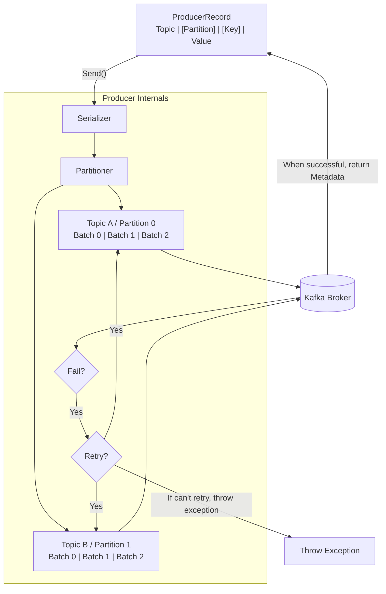
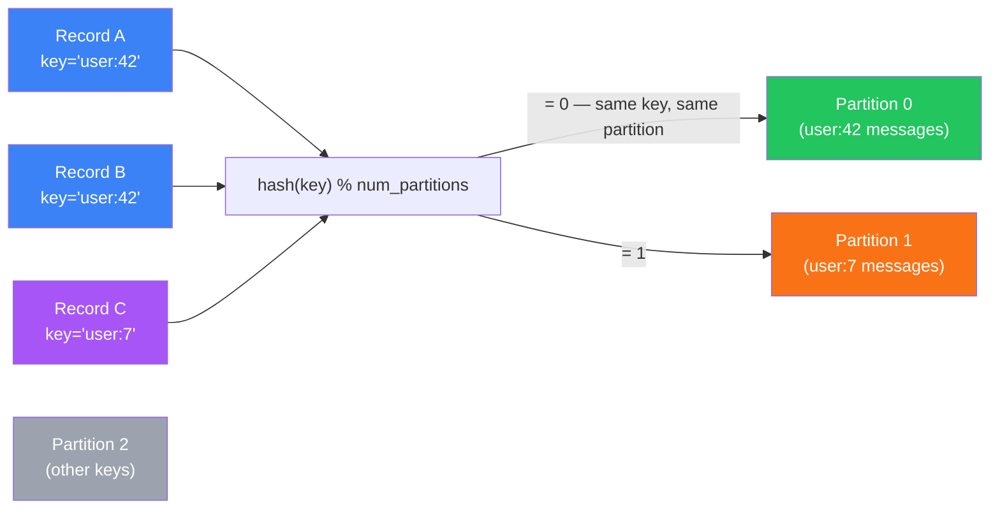
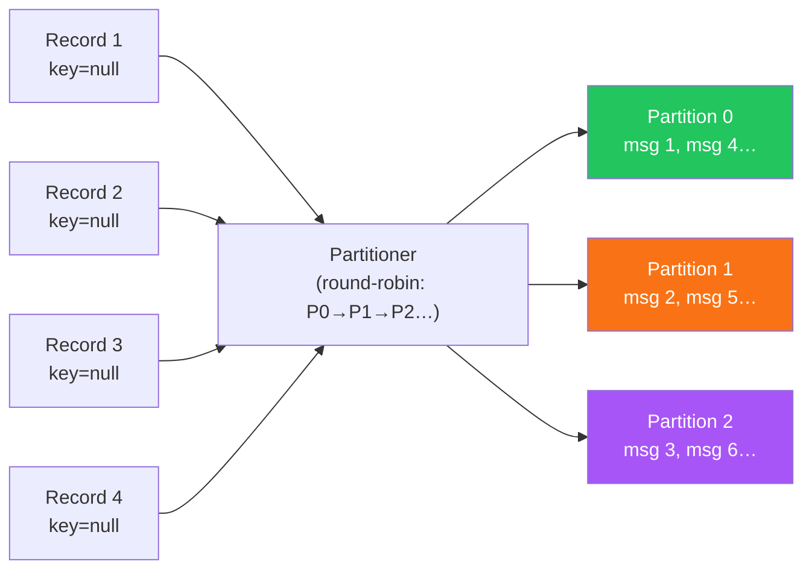
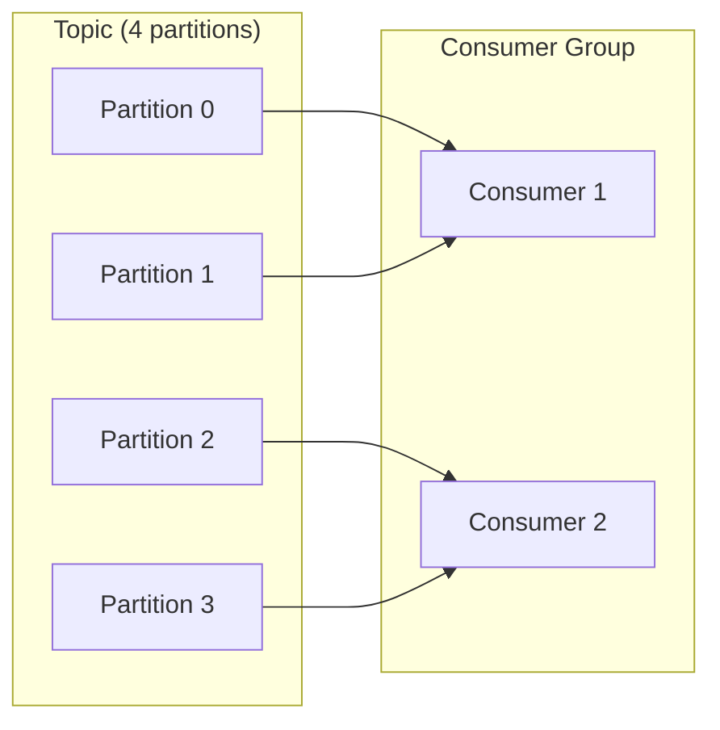
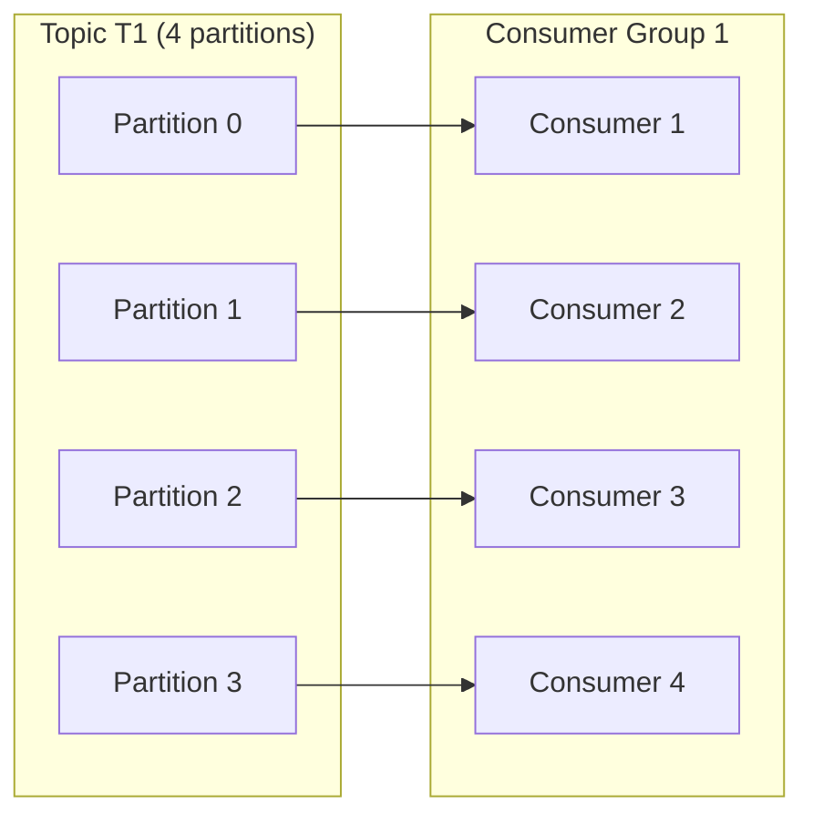
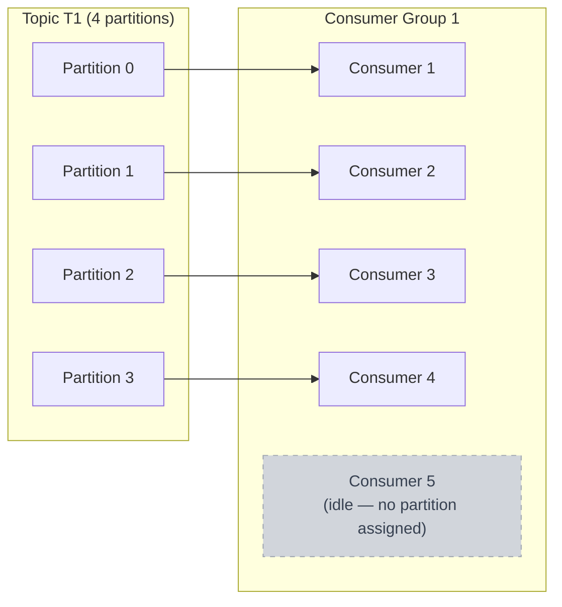

Apache Kafka's power comes from a deceptively simple model: producers write messages to topics, consumers read from them. But the real machinery — ordering guarantees, parallel consumption, fault tolerance — all lives inside the partition. This post walks through the full picture, from producer routing decisions to offset management and rebalancing.

## Topics and Partitions

A **topic** is a named stream of records. It's the logical unit you interact with as a developer. Internally, a topic is divided into one or more **partitions** — ordered, append-only logs stored on disk.

Each partition is an independent sequence. Messages within a partition have a guaranteed order. Messages across partitions have none.

Partitions are the unit of:
- **Parallelism** — producers can write to different partitions simultaneously; consumers can read in parallel
- **Replication** — each partition has one leader and zero or more followers; Kafka ensures durability by replicating across brokers
- **Scalability** — adding partitions lets you scale throughput horizontally

## The Producer Side: Who Picks the Partition?

Before routing decisions happen, a producer passes a message through a pipeline of internal components — serializers, partitioner, and a per-partition record accumulator — before batching it to the broker.



A producer always targets a **topic**, never a partition directly. But every message lands in exactly one partition. The selection follows a strict priority chain:

1. **Explicit partition id** — if you set `partition` in the `ProducerRecord`, Kafka uses it unconditionally.
2. **Key-based hashing** — if you provide a message key, Kafka computes `hash(key) % num_partitions`. The same key always routes to the same partition. This gives you **per-key ordering** — useful when all events for a given entity (user, order, device) must be processed in sequence.
3. **Round-robin (or sticky)** — no partition, no key? Kafka distributes messages evenly across partitions. Modern clients use a *sticky* strategy — batching to one partition until the batch is full, then rotating — to improve throughput without sacrificing fairness.



The critical implication: **ordering is only guaranteed within a partition**. If you need strict global ordering across all messages, you're forced to use a single partition — which eliminates parallelism entirely. In practice, most systems choose a meaningful key (customer ID, device ID, entity ID) and accept per-key ordering as sufficient.

**Round-robin** distributes messages evenly with no ordering guarantee — suited to high-throughput pipelines where per-message ordering doesn't matter.



### Choosing Keys Wisely

A good partition key distributes load evenly across partitions. A bad key causes **partition skew** — one partition receives far more messages than others, creating a bottleneck.

Avoid keys that have low cardinality or that cluster heavily (e.g. using a boolean field, or a status code with 90% of messages sharing one value). Prefer high-cardinality, evenly distributed identifiers.

## The Consumer Side: Group ID Matters More Than You Think

Every consumer should set a `group.id`. Without it, you're using the simple (assign) API — you manage partition assignment yourself and Kafka does not track your offsets.

With a group ID, Kafka treats all consumers sharing that ID as a **single logical subscriber**. The group collectively consumes the topic: each partition is assigned to exactly one consumer in the group at any point in time.

This means:
- **Within a group**, no two consumers ever read the same partition simultaneously — no duplicate processing
- **Across groups**, each group gets its own independent read cursor — two groups on the same topic each receive every message

A common pattern is to have one consumer group per downstream system or application. Your analytics pipeline and your alerting system can both consume the same topic independently.

## Partition-to-Consumer Mapping: Three Scenarios

Think of partitions as units of work and consumers as workers.

### Fewer consumers than partitions

Some consumers handle multiple partitions. Throughput is limited by the slowest consumer. This is a normal operating state — it still works, it just means some consumers carry more load.



### Consumers equal partitions

Clean 1:1 mapping. Each consumer owns exactly one partition. This is the ideal steady state for maximum parallelism with no idle capacity.



### More consumers than partitions

The extra consumers sit idle. Kafka cannot split a single partition across multiple consumers within the same group — a partition is always owned by at most one consumer per group.



If you have 5 consumers and 4 partitions, the 5th consumer does nothing. Adding more consumers beyond partition count gives zero throughput benefit.

**The rule:** increase partition count before increasing consumer count. You can always add consumers up to the partition count; beyond that, scale the partitions first.

## The Group Coordinator and Rebalancing

Every consumer group has a **Group Coordinator** — an elected broker responsible for:

- Receiving periodic heartbeats from consumers (detecting failures)
- Handling offset commits
- Triggering and coordinating **rebalances**

A rebalance happens when the group membership changes: a consumer joins, crashes, or is removed. During a rebalance, partition assignments are redistributed across the current live consumers. While a rebalance is in progress, consumption pauses — this is a known latency source in high-throughput systems.

To minimise rebalance frequency:
- Set `session.timeout.ms` and `heartbeat.interval.ms` appropriately (heartbeat should be roughly ⅓ of session timeout)
- Use `max.poll.interval.ms` to bound how long processing a single batch can take before Kafka considers the consumer dead
- Consider static membership (`group.instance.id`) for consumers that restart frequently — it allows a consumer to rejoin without triggering a full rebalance

## Offset Management

Kafka tracks where each consumer group is up to via an internal topic: `__consumer_offsets`. Each (group, topic, partition) triple has an associated committed offset — the position of the last successfully processed message.

**Auto-commit** (`enable.auto.commit=true`, the default) commits offsets on a schedule (`auto.commit.interval.ms`, default 5 seconds). This is convenient but means you can re-process messages after a crash if processing happens between commits.

**Manual commit** (`enable.auto.commit=false`) gives you control. Commit only after your downstream write succeeds:

```java
while (true) {
    ConsumerRecords<String, String> records = consumer.poll(Duration.ofMillis(100));
    process(records);                     // write to database, call API, etc.
    consumer.commitSync();                // only commit after successful processing
}
```

Use `commitAsync()` for throughput-sensitive paths where you can tolerate occasional reprocessing. Use `commitSync()` when correctness matters more than latency.

### Offset Reset Behaviour

When a consumer group starts fresh — or its committed offset is gone because the partition was compacted or the group is new — `auto.offset.reset` determines where to begin:

- `latest` (default) — start from messages arriving after the consumer starts. Historical messages are skipped.
- `earliest` — start from the oldest retained message in the partition.
- `none` — throw an exception if no committed offset exists (useful to catch misconfiguration early).

There is no way to go back past what Kafka has retained. Design your **retention window** (`retention.ms`, default 7 days) around your slowest realistic consumer, not your average one.

## Replication and Durability

Each partition has one **leader** and zero or more **followers** (replicas). All reads and writes go through the leader. Followers replicate asynchronously.

The **In-Sync Replica (ISR)** set contains replicas that are caught up with the leader within a configurable lag threshold. A message is considered committed when it has been written to all ISRs.

`acks` on the producer controls the durability guarantee:
- `acks=0` — fire and forget; no guarantee
- `acks=1` — leader acknowledged; followers may not have it yet
- `acks=all` (or `-1`) — all ISRs acknowledged; strongest durability guarantee

For production systems handling important data, use `acks=all` together with `min.insync.replicas=2` (or higher) to ensure at least two brokers have the message before the producer considers it sent.

## Compaction vs. Retention

Kafka supports two log cleanup strategies per topic:

**Delete** (default) — messages are removed after `retention.ms` or when the log exceeds `retention.bytes`. Suitable for event streams where you care about recency.

**Compact** — Kafka retains only the latest message per key, indefinitely. Older messages with the same key are garbage collected. Suitable for changelog or state-snapshot topics — the topic acts like a key-value store that consumers can replay to reconstruct state.

A topic can use `cleanup.policy=compact,delete` to combine both: compacted within the retention window, deleted after.

---

Understanding partitions as the fundamental unit of parallelism makes every other Kafka decision clearer. Producer key selection, consumer group sizing, rebalance tuning, offset strategy — all of it flows from how partitions work and how they are assigned.

The partition count you set at topic creation is hard to change later (increasing is possible but requires care; decreasing is not supported without recreation). Think through your throughput requirements, consumer parallelism needs, and key distribution before you create a topic in production.
