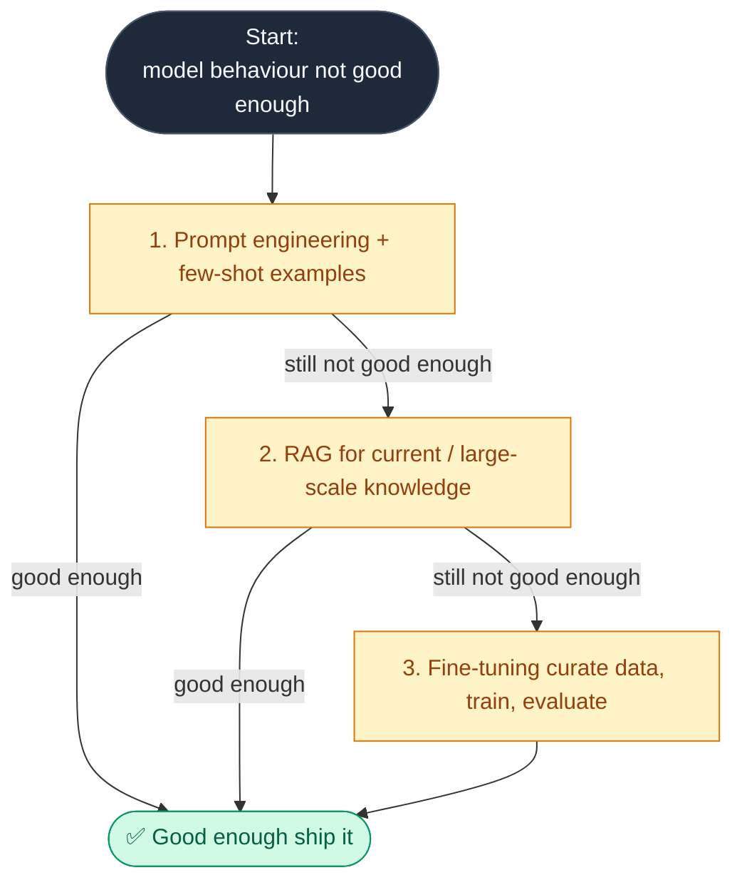
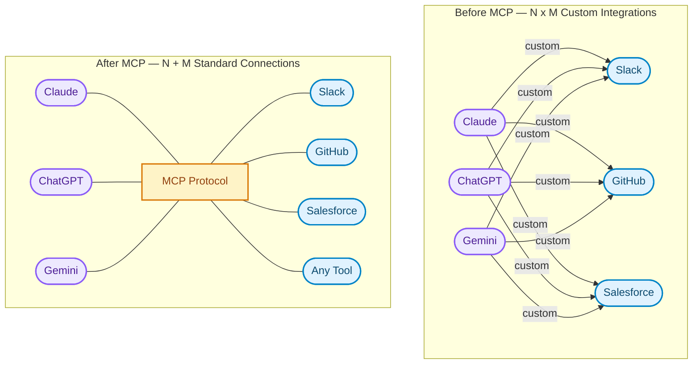
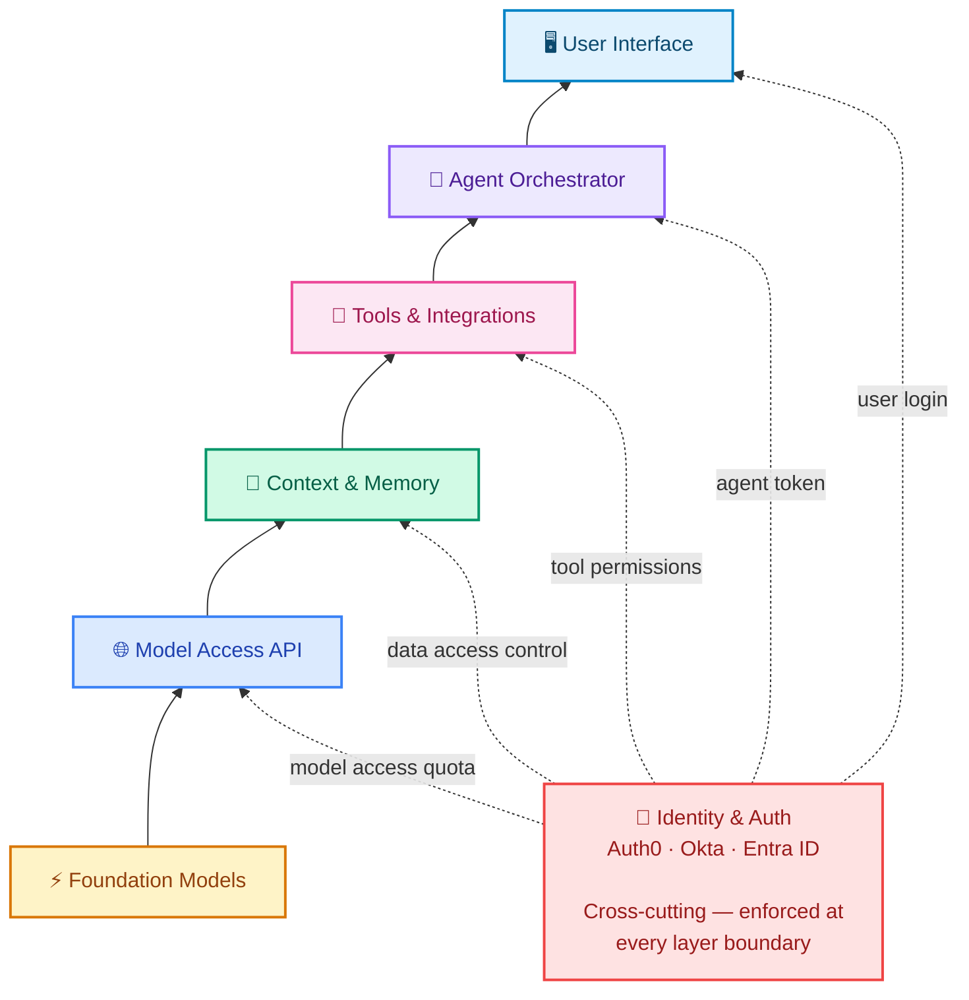
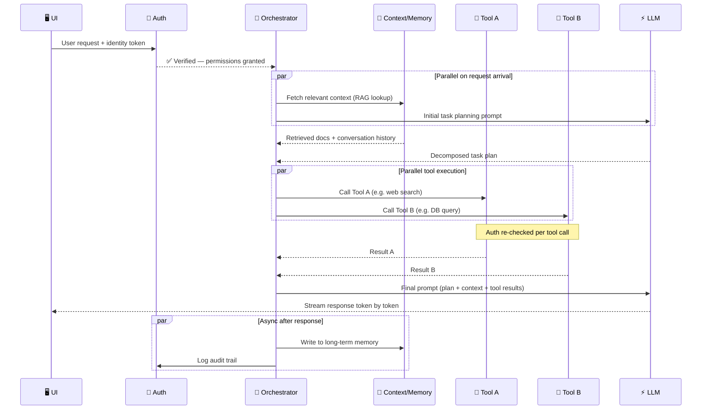
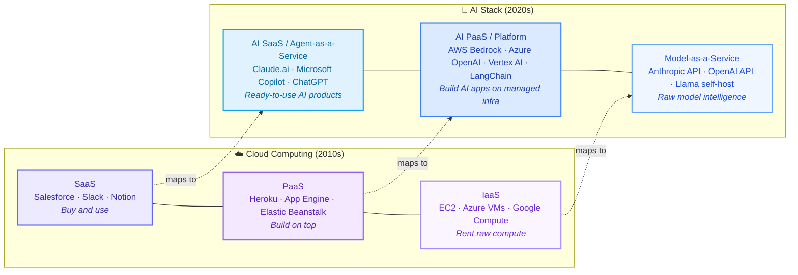
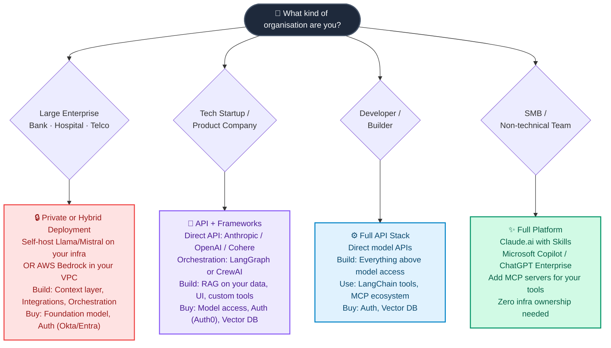

There's a pattern that keeps showing up in AI teams right now: someone decides to build a layer that, six months later, ships as a managed feature from AWS, Anthropic, or a framework update. Custom model routing. Hand-rolled vector search. Bespoke auth middleware for agent workflows. The engineering is sound — but the timing is off, and the layer gets abandoned or rewritten.

It's not bad engineering. It's building without a clear map — specifically, without knowing which layers are worth owning and which are commoditizing faster than most teams can ship them.

The cloud computing era gave us a useful mental model: IaaS, PaaS, SaaS. You knew exactly where AWS ended and your application began. AI is producing something similar right now, layer by layer. This post is that map.

---

## The Seven Layers of an AI Application

Think of any AI product you've used — a chatbot, a coding assistant, an AI analyst inside your SaaS tool. Behind that simple interface sits a surprisingly deep stack. Let's walk through each layer from the ground up.

---

### Layer 1: Foundation Models — The Intelligence Core

This is the raw intelligence. Large language models trained on vast datasets that can reason, write, code, and analyze. The engine, if you want a car analogy.

The major players as of early 2026:

| Provider | Models | Notes |
|----------|--------|-------|
| **Anthropic** | Claude Haiku 4.5, Sonnet 4.6, Opus 4.6 | Strong on safety-critical and enterprise tasks; Sonnet and Opus now support 1M token context |
| **OpenAI** | GPT-4o, o3, o4-mini | Widest ecosystem, most integrations |
| **Google** | Gemini 2.5 Pro / Ultra | Up to 2M token context, strong multimodal |
| **Meta** | Llama 3 (open-source) | Free to run, self-host friendly |
| **Mistral** | Mistral Large, Mixtral | Lean, fast, open-weight |
| **Cohere** | Command R+ | Optimized for enterprise RAG |

Unless you're Anthropic, OpenAI, or Google, you're not training foundation models — the cost is in the hundreds of millions of dollars. That layer is "buy," full stop. But there's a meaningful customisation step between "buy a raw model" and "call the API as-is" — and that's where a lot of teams leave value on the table.

#### Layer 1.5: Model Fine-Tuning — When the Base Model Isn't Enough

Fine-tuning specialises a foundation model on your own labeled data — without starting from scratch. Most teams reach for it too early. The decision ladder:

The fine-tuning *infrastructure* is increasingly "buy" (Bedrock, Vertex, Azure all offer it as a managed service). The data curation and evaluation pipeline is firmly "build" — and it's the part that takes the most time.

---

### Layer 2: Model Access (The API Layer)

Raw models don't serve themselves. This layer wraps foundation models in managed inference infrastructure — handling rate limits, routing, fallbacks, billing, and compliance.

This is where the cloud giants have moved aggressively:

- **AWS Bedrock** — One API to access Claude, Llama, Mistral, Titan, and more. Deep AWS IAM integration.
- **Azure OpenAI Service** — Used by 80,000+ organizations. Now includes Claude models following Microsoft's $5B Anthropic investment in late 2025.
- **Google Vertex AI** — Gemini-native, with GCP data gravity advantages.
- **Direct APIs** — Anthropic API, OpenAI API, Cohere API. Lower abstraction, more control, often cheaper for pure-play usage.

The cloud providers essentially become the "model broker" — abstracting away which model is running and adding enterprise compliance layers (HIPAA, SOC 2, data residency) on top.

---

### Layer 3: Context & Memory — What the AI Knows Right Now

An LLM, by default, knows nothing about your data. It can't search your Notion, query your database, or remember what you told it last week. Layer 3 solves this.

It has two parts:

**Short-term context (in-session)**
- The context window itself (Claude Sonnet/Opus 4.6's 1M tokens, Gemini 2.5 Pro's 2M tokens)
- Session state management
- Conversation history compression

**Long-term memory (cross-session)**
- **Retrieval-Augmented Generation (RAG)** — Chunking your documents and retrieving relevant passages at query time
- **Vector databases** — Pinecone, Weaviate, Qdrant, pgvector (PostgreSQL extension), Milvus
- **Knowledge graphs** — For structured relational knowledge

This is the layer I see teams underinvest in most consistently. The models themselves are getting cheaper and more capable every quarter, but the work of building a clean, well-curated index of your internal knowledge doesn't happen automatically. A vector index of your internal docs, customer conversations, and product knowledge is genuinely hard to replicate — and it's yours. Worth owning.

---

### Layer 4: Tools & Integrations — Giving AI Hands

A language model that can only *talk* is limited. This layer gives AI the ability to *act* — by calling functions, reading from databases, sending emails, running code, and browsing the web.

This is the layer that **Model Context Protocol (MCP)** transformed.

Before MCP (pre-late 2024), every developer had to hand-write custom integrations: a custom connector for Slack, another for Salesforce, another for GitHub. N data sources × M models = N×M custom integrations. A maintenance nightmare.

**MCP — the USB-C moment for AI** — standardized this. Any MCP-compatible server can connect to any MCP-compatible AI. Anthropic introduced it in November 2024; OpenAI adopted it in March 2025. It is now the emerging standard.

**A word of caution though:** MCP is the right direction, but the ecosystem is still maturing. Not every service has a production-grade MCP server yet — and the ones that do vary widely in what they actually expose. In practice, you may still find yourself writing a custom REST connector for a specific API today, especially for niche internal tools or less mainstream SaaS products. That's fine — the pattern is evolving fast. Think of MCP as where you're heading, and REST-based custom connectors as the bridge until the ecosystem catches up. The pragmatic call right now is: use MCP servers where they're mature and well-maintained, fall back to direct REST APIs where they're not, and design your integration layer so swapping one for the other doesn't require rewriting your orchestration logic.

This layer is increasingly "buy" for commodity tools (web search, code execution, standard APIs) but "build" for your proprietary systems and internal tools.

---

### Layer 5: Agent Orchestration — The Brain Behind Multi-Step Tasks

A single model call handles a question. An *agent* handles a *task*. Orchestration is what transforms "here's a prompt" into "here's a workflow that plans, executes, reflects, and retries."

This is the fastest-moving layer in the stack. The major frameworks in 2026:

| Framework | Strength | Best For |
|-----------|----------|----------|
| **LangGraph** | Graph-based state machines with conditional routing | Complex workflows, long-running tasks |
| **CrewAI** | Role-based agents ("hire a team") | Multi-agent collaboration |
| **AutoGen** | Conversational, dynamic agent interactions | Flexible dialogue-driven workflows |
| **LlamaIndex Workflows** | RAG-grounded agents | Knowledge-intensive, document-heavy tasks |
| **Claude + Skills** | Fully managed orchestration + extensible tools | Non-technical teams, rapid deployment |
| **OpenAI Assistants API** | Managed threads, tools, file search | Teams already in the OpenAI ecosystem |

A few honest notes, since this table makes the options look more equivalent than they are in practice. I built a fairly complex workflow with AutoGen in 2024 and struggled badly with debugging in production — the conversational agent model is elegant conceptually, but painful when a loop goes wrong and you need to understand why. LangGraph is what I actually reach for now in anything non-trivial; the explicit state graph makes failures traceable. CrewAI gets impressive demos shipped quickly, which is great for stakeholder buy-in, but I've seen teams hit rough edges in production that weren't visible in the prototype.

That said, this space moves fast enough that my experience from 18 months ago is at least partially dated. Check current GitHub activity and Discord communities before committing to any framework.

The key decision here remains: **frameworks vs. full platforms.** Frameworks (LangGraph, CrewAI) give you control — you write the orchestration logic. Full platforms (Claude with skills, OpenAI Assistants) handle orchestration for you — you just configure it.

---

### Layer 6: Identity & Authentication — Who's Asking, and What Can They Do?

Often the most underestimated layer. As AI agents start taking real-world actions — booking meetings, sending emails, placing orders — questions of identity become critical:

- Which *user* authorized this action?
- Which *agent* is making this call?
- What permissions does this agent have?
- How do you audit what happened?

**Auth0** launched "Auth0 for AI Agents" in 2025, reaching general availability in November — the first enterprise-grade identity solution purpose-built for agentic workflows, including secure token vaults and async authorization. **Okta**, **AWS Cognito**, and **Azure Entra ID** are all expanding their platforms to handle agent identity alongside human identity.

For most organizations: buy this. Identity is hard to get right, compliance is non-negotiable, and the managed providers have spent years building what you'd spend months reproducing. This isn't a layer that benefits from home-grown solutions.

---

### Layer 7: User Interface — What People Actually See

The top of the stack. The way humans (and other systems) interact with the AI application.

Options range from:
- **Chat interfaces** — Vercel's AI SDK, Chainlit, custom React with streaming, HTMX for lighter server-rendered setups
- **Voice interfaces** — OpenAI Realtime API, ElevenLabs + LLM pipelines
- **Embedded widgets** — AI inside your existing product (a Figma plugin, a Salesforce sidebar)
- **Fully headless** — Background agents that output to Slack, email, or databases, not a UI at all

If your AI product's UI is the differentiator (think: Cursor, Perplexity), build it. If it's just a wrapper around functionality that lives lower in the stack, buy a component or embed an existing interface.

---

## Where the Stack Diagram Breaks Down

The seven-layer diagram above is the right mental model for *understanding ownership and responsibility*. But it is **not** a literal description of how requests flow at runtime. Real AI applications are messier and more interesting than that.

Three things break the "pure stack" idea:

**1. Auth is a cross-cutting concern, not a single layer**

Identity and authorisation don't just happen once at the UI. They re-apply at every layer boundary — when the orchestrator calls a tool, when a tool queries a database, when the model access layer enforces rate limits per user. Think of Auth less as Layer 6 and more as a *membrane* that wraps every transition in the stack.

**2. Context retrieval and tool execution happen in parallel**

The orchestrator doesn't wait for a full sequential chain. A well-built agent will kick off a RAG lookup and a tool call at the same time, merging results before hitting the model. This is especially visible in LangGraph (parallel nodes) and CrewAI (concurrent task assignment across agents).

**3. The runtime is a loop, not a one-way flow**

Agents plan → execute → observe → re-plan. A single user request can trigger multiple model calls, cross-layer callbacks, and async memory writes happening in the background after the response has already streamed to the user.

Here's what a realistic request actually looks like:

**The practical implication:** when you're designing an AI system, the *stack* tells you who owns what. The *sequence diagram* tells you where latency hides. The two biggest parallelism wins in production systems are (a) fetching context and planning simultaneously, and (b) running independent tool calls concurrently rather than in sequence.

---

## The Cloud Analogy: IaaS → PaaS → SaaS, Now for AI

The cloud computing stack gave us a useful mental model for understanding ownership and abstraction. AI is replicating it almost exactly.

Just as in cloud, the higher you go up the stack:
- **Less control** but **less complexity**
- **Higher cost per unit** but **lower total cost of ownership**
- **Faster to start** but **harder to customize deeply**

And just as in cloud, the right answer depends on what makes your organization competitively unique.

---

## What Should Your Organization Actually Own?

Own layers where you have unique data, unique workflows, or unique customer relationships. Buy everything else.

Three patterns I see in the wild, with honest notes on where each falls short:

---

### "We just want to use AI"
*Profile: SMB, non-technical team, HR department, marketing agency, operations team*

**Recommended approach: Full platform (AI SaaS)**

Use Claude.ai with skills, Microsoft Copilot, or ChatGPT Enterprise. Add MCP servers for your specific tools (Slack, Google Drive, CRM). You own nothing in the stack below Layer 7 — and that's completely fine. The platform handles the model, orchestration, memory, and auth.

The failure mode here is scope creep into customization. Teams start on a managed platform, hit one edge case it doesn't handle, and start bolting on custom layers to work around it. Suddenly you're maintaining infrastructure you didn't plan for. If you consistently find yourself hitting the edges of a managed platform, that's a signal to reassess the platform choice — not a reason to build a layer on top of it.

**Analogy:** You're the team using Salesforce. You're not running a database — you're entering deals.

---

### "We're building an AI-powered product"
*Profile: SaaS startup, product company, developer tool*

**Recommended approach: AI PaaS (build on managed infrastructure)**

Use AWS Bedrock or the direct Anthropic/OpenAI APIs for model access. Build your own context layer — your data is your moat. Use an orchestration framework like LangGraph or CrewAI for complex workflows. Buy auth from Auth0. Build your UI as a competitive differentiator.

The trap here is over-building. Every layer feels important when you're planning. In practice, the teams I've seen succeed started with a direct API and a simple retrieval layer, shipped early, and added orchestration complexity only when the product demanded it. It's much easier to add a LangGraph workflow to a working product than to debug a multi-agent system that hasn't shipped yet.

**Analogy:** You're building a SaaS app on AWS. You use EC2, RDS, and S3 — but you write the application logic.

---

### "We have sensitive data and compliance requirements"
*Profile: Bank, hospital, government, legal firm*

**Recommended approach: Hybrid (private deployment + cloud AI PaaS)**

Either self-host open-source models (Llama 3, Mistral) on your own infrastructure, or use cloud provider AI services with data residency guarantees and BAA/DPA agreements (AWS Bedrock in your VPC, Azure OpenAI with private endpoints). Build your own context layer with strict data governance. Use enterprise-grade auth (Okta, Azure Entra ID). Keep orchestration logic in-house or with approved vendors.

Honest caveat: self-hosting models is harder than the open-source community sometimes makes it look. Running Llama at production scale — with GPU infrastructure, model updates, serving latency, and monitoring — is a serious ongoing engineering investment. For most regulated organizations, a cloud provider's managed AI service with data residency commitments is a better trade than a self-hosted stack that's harder to audit and update.

**Analogy:** You're an enterprise that runs a private cloud in a regulated region — you use cloud technology patterns but on infrastructure you control.

---

## What's Actually Shifting Right Now

A few forces are reshaping the stack in 2026. I'll flag my confidence level on each, because some of these I'm genuinely less sure about than they might sound.

**Fine-tuning is becoming accessible, but RAG still wins more often.** The infrastructure for fine-tuning has commoditized fast — Bedrock, Vertex, and Azure all offer it as a managed service now. But the pattern I keep seeing is teams reaching for fine-tuning before exhausting what good RAG and prompt engineering can do. The right call: treat fine-tuning as a tool you graduate to when the evidence demands it, not a first step.

**MCP is eating custom integrations.** Fairly confident here. The network effect is real — as more tools publish MCP servers, the ecosystem compounds. Building bespoke tool connectors is starting to feel like writing custom REST parsers in 2015.

**Orchestration is probably consolidating.** I've been wrong about "consolidation" timelines before in this space, so take this with some salt. LangGraph and CrewAI have strong momentum heading into 2026, and the explosion of frameworks from 2024 does seem to be settling. But whether that holds for the next 12 months is genuinely unclear. Choose your framework with eyes open to migration cost.

**Memory is becoming the real moat.** The gap between GPT-4o, Claude Sonnet 4.6, and Gemini 2.5 Pro is smaller every quarter — the models themselves are commoditizing. What's *not* commoditizing is the rich, curated knowledge base you've built about your customers, products, and domain. Layer 3 is where differentiation lives, and it's the layer most teams underinvest in.

**Agent identity is the next compliance frontier.** As agents take real-world actions, audit trails, delegation models, and non-human identity management will face the same regulatory scrutiny that human identity did five years ago. Most organizations I talk to haven't started thinking about this. Getting ahead of it now is wise.

**The lines between layers are blurring.** Full-stack platforms like Claude.ai with skills, Microsoft Copilot, and Salesforce Einstein are collapsing multiple layers into managed services — useful for many use cases, but the lock-in risks aren't always visible until you need something the platform doesn't support.

---

## Making the Decision: A Practical Framework

Before adding any layer to your stack, three questions worth asking:

**1. Is this a source of competitive advantage?**
If yes → build it and own it. If no → buy the best managed service. Most teams overestimate how many layers are genuinely differentiating.

**2. Does this layer touch proprietary or regulated data?**
If yes → pay close attention to data residency, logging, and access controls. Private deployment may be necessary.

**3. How often will this layer change?**
Foundation models evolve quarterly. If you're tightly coupled to a specific model, you'll spend engineering time on upgrades. Abstract model access behind an API layer (like Bedrock or a model router) to stay model-agnostic.

---

## The Bottom Line

The AI stack is no longer a mystery — it's an engineering discipline with clear layers, established tooling, and a growing ecosystem of providers competing to make each layer cheaper and easier to use.

The organizations doing well with AI aren't necessarily those with the biggest models or the most engineers. More often, they picked a lane early, invested seriously in their context and memory layer, and kept their architecture loose enough to swap components as the landscape shifts. That last part is harder than it sounds — there's always pressure to tightly couple to whatever works today.

The map isn't perfect. The landscape will look different in 18 months. But having a map at all puts you ahead of most teams still treating every AI integration as a bespoke plumbing project.

---

*Have thoughts on where this stack is heading? What layers are you building vs. buying? I'd love to hear — the architecture is still evolving and every team's experience shapes the field.*
