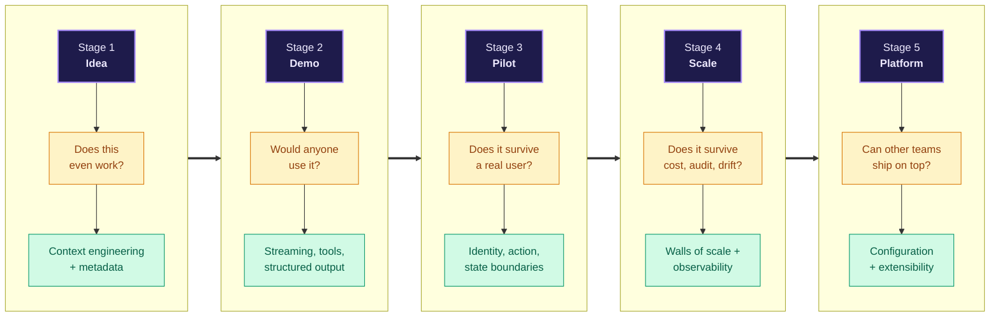
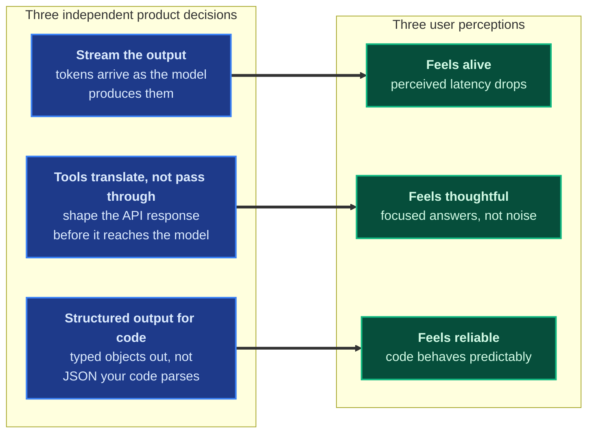
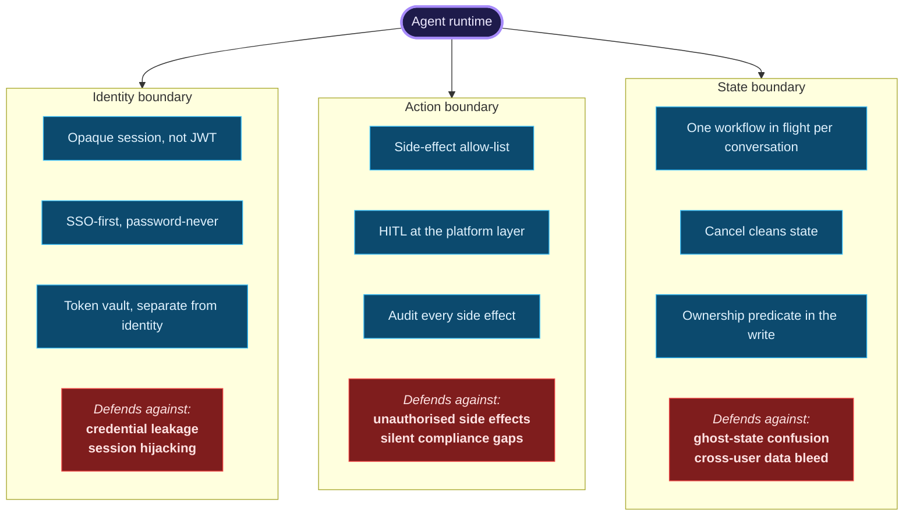
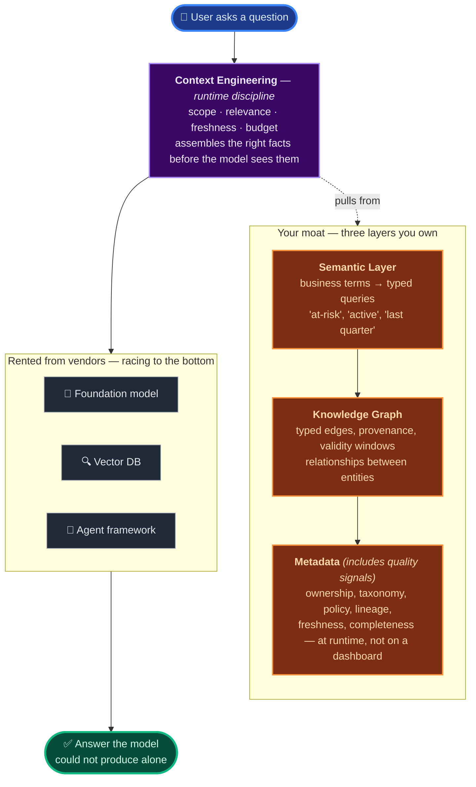

There's a pattern that keeps showing up across AI teams right now: the demo dazzles, the pilot stumbles, and the launch never quite arrives. Six months in, someone in the room says, *"the model isn't the problem."* They're usually right. The model is rarely the problem. The product around the model is.

This is the field guide I'd hand to any team building an AI agent in 2026 — what to think about at each stage of the product's life, which disciplines earn their place when, and which decisions to make once so you don't relitigate them every sprint. It builds on a piece I wrote earlier this year on [the seven-layer AI stack]() — same thesis on where the moat lives, walked through the product's lifecycle instead of the architectural stack.

The argument has three moves:

1. **Every AI agent product walks the same five stages.** The disciplines that matter shift with each stage.
2. **Almost every *"the AI is unreliable"* complaint traces back to a discipline a team skipped two stages ago.**
3. **The part of the stack worth owning isn't the model — it's the data substrate underneath it.** Everything else is rented.

---

## The Five Stages

Each stage of an AI agent product asks a fundamentally different question. The leader's job is knowing which one the team is in and applying the disciplines appropriate to *that* stage — not the next one, not the previous one.

Earlier patterns are wasted work. Later patterns are technical debt. Most platforms that fail in 2026 fail by acting like they're in a later stage than they are.

---

## Stage 1 — Idea: optimise for learning, not building

The first stage isn't engineering. It's epistemics. The only question that matters is whether the underlying idea even works, and the answer rarely needs more than a notebook and a managed model API. Teams who start "the production codebase" before they've validated the intent waste the first three months solving problems for products that don't exist.

Two disciplines show up early and keep paying off across every later stage.

**Context engineering, not prompt engineering.** The prompt is the wrapper. The context is the payload — the right facts, in the right shape, at the right time. Spending hours optimising prompt phrasing on the wrong data is the most common Stage-1 mistake. Five years from now, the cleverest prompt for any common intent will be a default the provider ships. Context won't be — it's built from your customers, your taxonomy, your entitlements.

**Metadata as the moat.** Every team has access to the same models. Almost nobody has access to your metadata — the ownership maps, the policy classifications, the business taxonomy your customers say out loud and your data warehouse stores under different names. None of this is buyable. All of it decides whether your AI product feels brilliant or feels generic. The model is rented from a vendor. The metadata is yours, forever.

Everything else at this stage is premature. Don't pick a framework. Don't pick a vector database. Don't build a routing layer. *Especially* don't build a routing layer.

---

## Stage 2 — Demo: the thinnest possible end-to-end

A demo's job is to change the temperature of a meeting. If a CFO leans forward, the demo worked. If they don't, the model wasn't the issue.

Three product decisions turn a demo into one that lands. Each one is independent. Each one shapes a different *feeling* the user has about the AI.

**Stream the output to the user.** A 12-second response feels slow; the same 12 seconds streamed feels alive. Time-to-first-token is the metric that matters; total latency matters far less. Streaming is what makes the product feel intelligent before it has earned the right to.

**Tools translate, not pass through.** Every tool function the agent can call is a translation layer between an API and the model. A 50KB raw API response in the model's context window doesn't fail loudly — it produces an agent that subtly forgets the original question. Researchers call this the *"lost in the middle"* problem: facts placed in the centre of a long context get retrieved less reliably than facts at the start or end. The fix is shaping, not truncation. A 2KB summary outperforms a 50KB dump every time, even when the answer is *in* the dump.

**Structured output for code, streaming for humans.** Every modern model API exposes two modes: streaming completions for the user, and structured output (function calling, tool use, JSON mode) for your code. Sharing one client between both is a foundational bug — the streaming path holds for a complete response, the structured path emits unparseable token fragments. Pick the audience for every model call first. The right mode follows.

At Stage 2, the technical debt you take on is fine — it's research debt, not architectural debt. Don't agonise over it. Ship the demo. Watch the room.

---

## Stage 3 — Pilot: where most teams live longest

The pilot is the most misunderstood stage in an AI product's life. Teams treat it like a smaller version of launch. It isn't. It's a different test entirely.

A pilot tests four things, and the model isn't one of them.

| What the pilot tests | What you learn |
|---|---|
| **Return** — does the same user come back tomorrow without prompting? | Whether the AI changes a habit, or just impresses once |
| **Survival** — what happens on edge cases and malformed input? | Whether the platform around the model is sound |
| **Trust** — does each interaction accumulate confidence or leak it? | Whether the user is on the path to daily use |
| **Org reaction** — what does the user's manager say at the next standup? | Whether the lateral spread will ever start |

The patterns that earn their keep at this stage are the boring, structural disciplines a team would rather defer. They aren't optional. **A pilot is the test of whether the disciplines were built.**

### Three boundaries that decide whether a pilot survives

**The identity boundary.** An agent conversation is long, mutable, and stateful. JWTs are the wrong tool — they're self-contained tokens your server cannot edit. Use an opaque session ID backed by a row your code can mutate. SSO from day one (most agent products target workplaces). OAuth tokens for third-party tools live in a separate, encrypted vault — never in the session.

**The action boundary.** This is the single most consequential policy in an agent product: *what can the AI do without human approval?* The answer is one explicit allow-list of side-effect tools. The runtime — not the tool — enforces approval. Human-in-the-loop is platform policy, not a per-feature toggle. Every side effect writes one audit row, and only side effects do.

**The state boundary.** The agent is a state machine. Pretending it isn't is the bug. One workflow in flight per conversation, modelled explicitly. Cancel deletes the checkpoint; it doesn't "mark cancelled." Authorisation lives in the database write itself, not three layers up where the next refactor will lose it.

The pilot looks like it tests the AI. It tests the platform.

---

## Stage 4 — Scale: when three walls arrive at once

A pilot that becomes a launch runs into three walls in the same quarter. Almost never one at a time, almost never politely. They are cost, compliance, and quality — and they reinforce each other.

**Cost.** Token spend compounds. Tool responses compound. Context bloat compounds. The pilot that costs cents per turn becomes a launch that costs dollars per active user per day if nobody watches the curve. Track cost per *workflow*, not per request. Make the number visible to the team deciding what to ship next.

**Compliance.** This wall doesn't sneak up — it lands the day procurement asks. Approval at the platform layer, audit on every side effect, application-side encryption for credentials, workload identity for the runtime: these aren't separate disciplines. They are *one discipline*, planted in Stage 3, that pays the entire compliance bill at Stage 4 in one go.

**Quality.** Models update. Prompts drift. Tool responses shift shape. The product that worked last week answers slightly differently this week and nobody can tell which change caused it. The discipline here is an evaluation harness — golden tasks, regression tracking, calibrated confidence — that the team uses as a release gate, not as a Friday afternoon afterthought.

Two infrastructure decisions that show up at Stage 4 specifically deserve a flag. **The sixty-second killer:** most load balancers, proxies, and CDNs default to a 60-second idle timeout. Streaming agent responses routinely run longer. Every *"the AI is slow"* complaint in production is actually a layer that closed the connection mid-stream. **The one trace key:** every log line in a request carries the same conversation identifier. When a user reports a problem, *"show me everything that happened"* becomes one query — not a forensics project.

---

## Stage 5 — Platform: when other teams ship on top of you

At some point — sometimes earlier than expected — the agent becomes infrastructure for the next team. Now the optimisation function changes again. The question is no longer *"does the product work?"* but **"how easy is it for the next team in to ship?"**

Three patterns dominate this stage. **Connectors should self-register** — adding an integration is a folder, not a sprint. **Workflows as configuration, not code** — a focused workflow ships as a declarative file with its system prompt, required fields, tool subset, and post-execution hooks. Product can ship a workflow without filing an engineering ticket. **Tools assembled per request, not globally** — the agent's toolbox is built per request, gated on the calling user's authorisation. A user who hasn't connected an integration literally cannot call its tools — the model can't propose it, the executor can't run it.

The mature platform's superpower isn't intelligence. It's the velocity at which a new workflow becomes a customer-visible feature.

---

## The Build-vs-Buy Question, in 2026

Across every stage, the most common over-investment is engineering a layer that the model providers and frameworks are about to ship for free. The cover image above already shows the shape of this — the rented cluster at the top (foundation model, vector DB, agent framework, model routing) versus the moat below. The forecast for the next twelve months is roughly the same shape: most of what's "rented" today gets cheaper and more capable; one or two layers currently in the "commoditising" middle (model routing, HITL primitives, eval platforms) move into the rented camp by next year. The moat doesn't move.

A three-line rule that's never led a team wrong, and one I'd put on a whiteboard: **managed for v1, fork at v3, never build at v0.** Use the highest-level managed thing at idea stage. Use managed everything at pilot. Profile at scale — *then* fork the layer that's actually killing you. Build only what your product sells on.

**Don't build your own model router.** Every provider now offers routing natively. The "we'll save 70% on cost" pitch sounds seductive; the reality is a small team that maintains a custom layer instead of shipping product.

**Don't build a vector database.** This is the most successfully commoditised layer in the AI stack. Pick a managed one. Worry about lock-in at a million vectors, not at a thousand.

**Don't build agent memory from scratch.** "Agent memory" is four different things — conversation context, workflow state, user profile, semantic recall. The framework handles two. A profile table handles a third. The fourth is being commoditised in front of you. Wait.

Honest caveat: I've been wrong about commoditisation timing before in this space. The *which layer* and *when* in the list above could shift by a quarter or two — but the *principle* (vendors absorb most layers faster than you can defend them) has held every time I've watched it play out. Take the specific predictions with some salt; take the framing seriously.

The half-built layer trap is the single most expensive class of mistake in AI engineering right now. A team builds a custom layer at v0; six months later the vendor ships the same layer as a managed feature; the team spends a quarter migrating or maintaining the abandoned code. The cost isn't the building. The cost is the maintenance, the hiring, the debugging, the lock-in.

---

## The Closing Thesis: Where the Moat Actually Lives

Walk all five stages and the conclusion clarifies. The model is rented. The frameworks are commoditising. The infrastructure is converging. The part of the stack that decides whether your AI product feels brilliant or feels like a tech demo is the *data substrate beneath it*.

It's tempting to break "the data substrate" into a long list of components. In practice, three things are worth building — and one runtime discipline holds them together.

**Three storage and interface layers** are worth your engineering hours.

**Metadata** — the layer the foundation model can't see and your competitor doesn't have. Ownership maps, business taxonomy, policy classifications, data lineage. *And quality signals* — freshness, completeness, classification. Quality signals aren't a separate layer; they're metadata you actually use at retrieval time. Most teams generate them already and leave them stranded on a dashboard. The shift is to move them into the runtime filter.

**Knowledge graph** — typed edges, provenance per relationship, validity windows. Vector search finds candidate entities by similarity. The graph hydrates them with their relationships, owners, and lineage. Most serious agents need both, even when they don't admit it.

**Semantic layer** — the thin translation between *how the business talks* ("at-risk accounts," "active customers," "last quarter") and *how the data is stored*. One definition per term. Owned. Versioned. Composed at runtime, so the day a definition changes, every product surface that depends on it updates with no retraining.

**One runtime discipline** ties the three together.

**Context engineering** — the active process that assembles the model's context window on every turn. Scope (which entities is this user allowed to see?), relevance (which relationships matter for this intent?), freshness (which facts have changed since the model last saw them?), budget (what fits in the model's effective working memory?). Context engineering isn't a static layer like the three above — it's the runtime process that *uses* the three to compose what the model reads. It's where prompts go to die and where products go to differentiate.

This is the part the customer never sees but always feels. This is the part nobody can rent for you. **Build there.**

---

## What's Next

This essay is the map. Over the coming weeks I'll be publishing short pieces on [LinkedIn](https://www.linkedin.com/in/mrsrinivas) — one pattern at a time, each with a diagram, each going deeper into one of the disciplines named above. Honestly, I learn as much from writing them as anyone learns from reading them; the patterns get sharper when you have to defend them in two hundred words.

There'll be a follow-up long-form piece later — a recap with everything indexed, plus the bits I get wrong here that I'll probably want to walk back. (And there will be some. Always are.)

The patterns are the easy part once you can name them. Naming them is what this essay is for.
